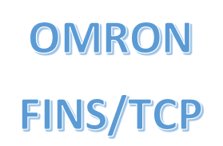

# ioBroker.omron-fins

Connect Omron CP, CV, CS, CJ, NJ and compatible NX PLCs to ioBroker using the FINS protocol over UDP or TCP.

German documentation: [READMEde.md](READMEde.md)

## Configuration

Configure the PLC IP address, FINS port (normally `9600`), protocol and polling interval in the responsive adapter administration page. Destination/source node values may remain `0` for automatic addressing unless the PLC network requires explicit FINS routing.

Variables can be entered manually with a unique name, FINS address and data type. Supported examples include `CIO0.00` (or legacy `CB0:00`), `W31.00`, `H0.01`, `A0.00`, `D100`, timers and counters.

Each variable becomes a writable ioBroker state unless the writable option is disabled. Writes are acknowledged only after the FINS request succeeds.

## CX-Programmer symbol table import

Export the symbol table from CX-Programmer as CSV or tab-separated text and paste its contents into the corresponding configuration field. The adapter detects English and German name/address/data-type headers and imports the symbols automatically. Comma, semicolon and tab delimiters are supported. Manual variables override imported symbols with the same name.

## Troubleshooting

- `info.connection` is only true after a successful PLC response.
- `info.lastError` contains the most recent communication or configuration error.
- Check UDP/TCP port 9600 and the PLC FINS/ETN settings.
- If automatic node addressing fails, configure DA1 and SA1 explicitly.

## Changelog

### 0.1.0

- Updated for Node.js 22/24, js-controller 6 and current adapter-core
- Replaced the legacy administration page with responsive JSON Config
- Added UDP/TCP, timeout and FINS node settings
- Added automatic CX-Programmer CSV/TSV symbol table import
- Prevented overlapping polls and added reliable connection/error handling
- Updated tests, linting, release and Dependabot workflows

### 0.0.2

- Improved cyclic polling

## License

Copyright (c) 2021-2026 TheBam <elektrobam@gmx.de>

MIT License. See [LICENSE](LICENSE).
